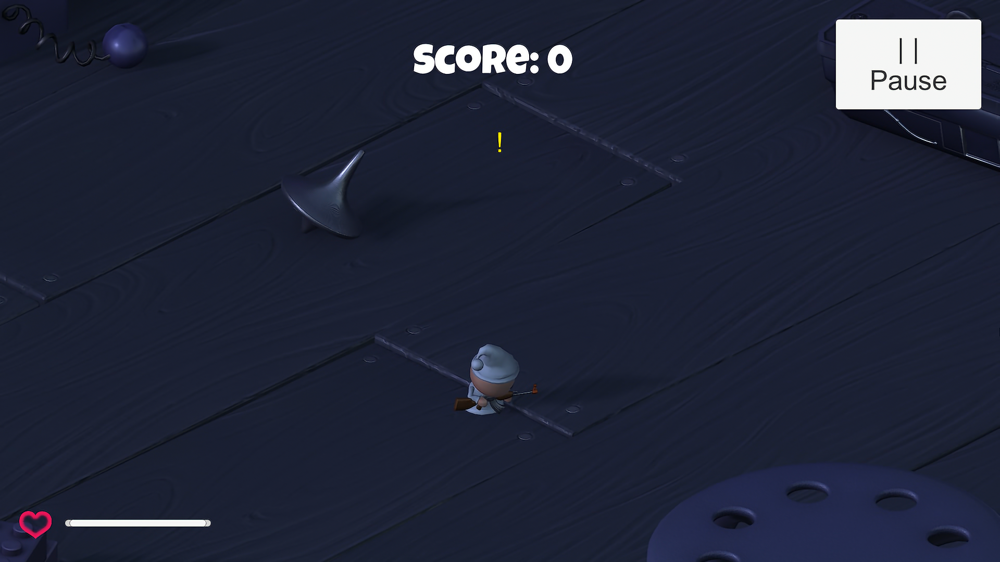
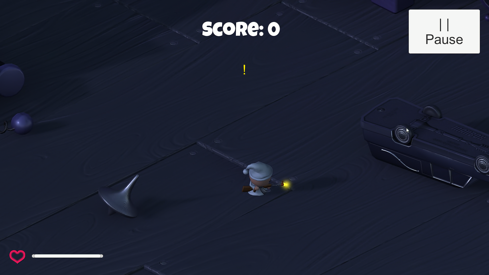
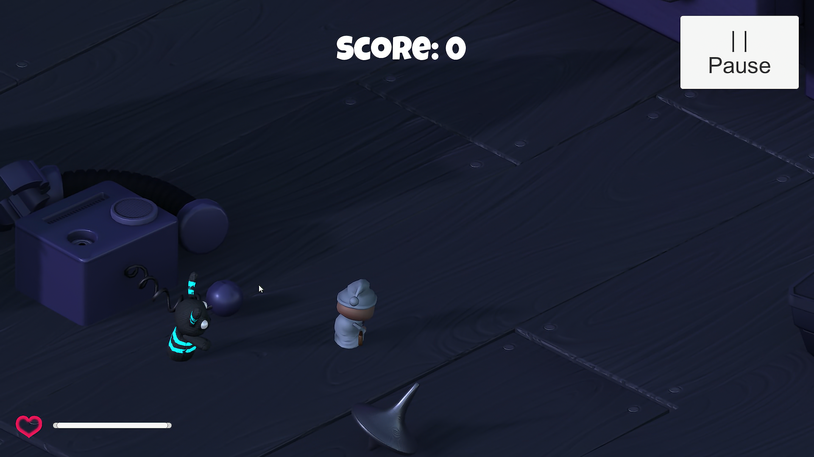
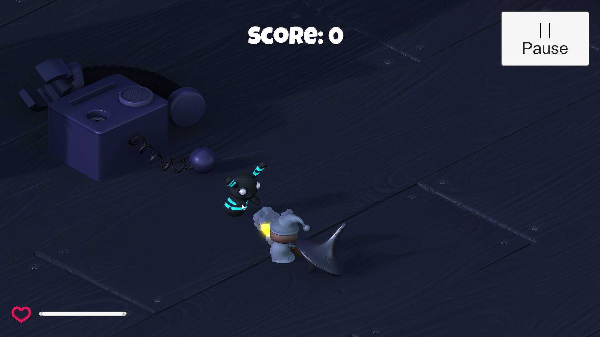
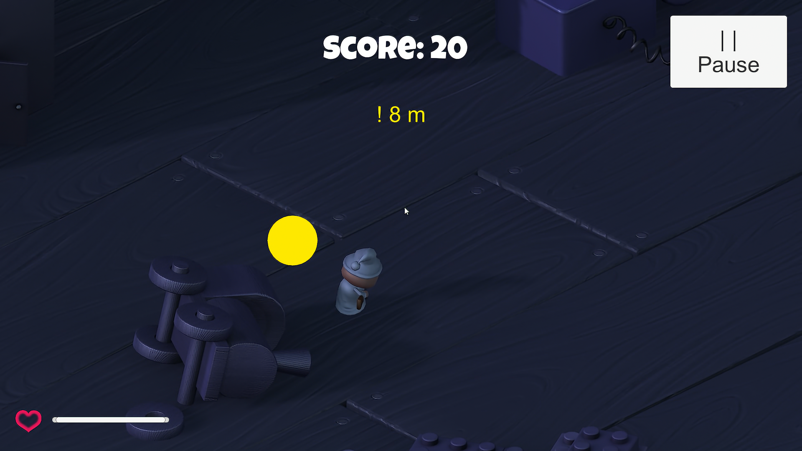
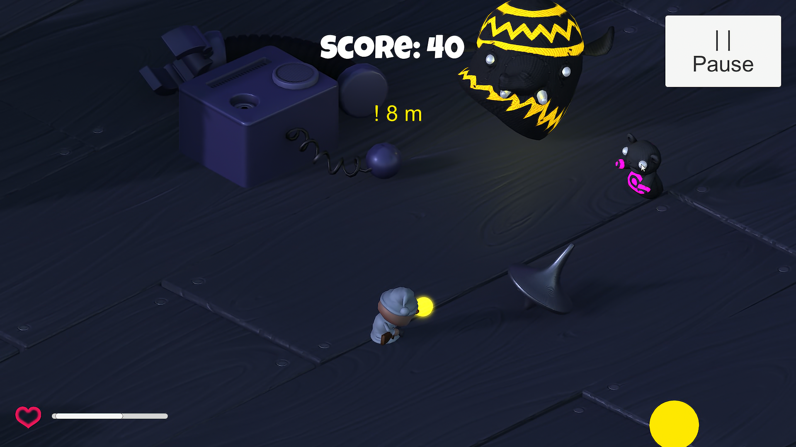

# 3D Survival Shooter Game

## Features

1. Power (Speed and Healing)
2. UI (Score, Lives, and Pause)
3. Enemies
4. Sound Effect

### Built With

* [![Unity][Unity.com]][Unity-url]

[Unity.com]: https://img.shields.io/badge/Unity-FFFFFF?style=for-the-badge&logo=unity&logoColor=black
[Unity-url]: https://unity.com/

## Documentation

### Game Preview
      

### Demo

## Prerequisite

- [Unity 2018.3.3 ](https://unity3d.com/get-unity/download/archive)

## Installation

- Add [Unity](https://store.unity.com/front-page?check_logged_in=1#plans-individual) to your machine

- Add this project folder on Unity and run

